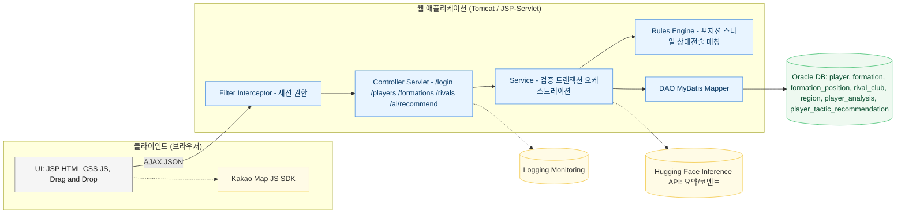
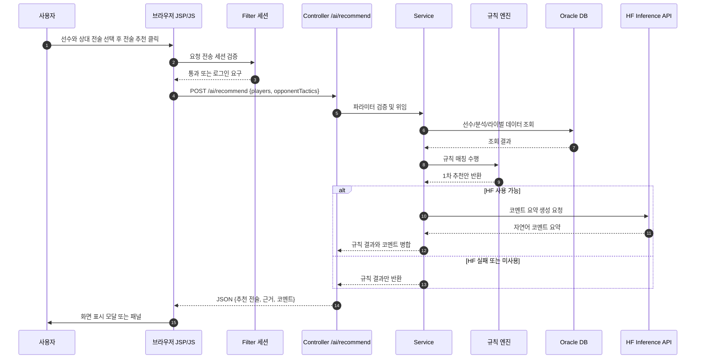
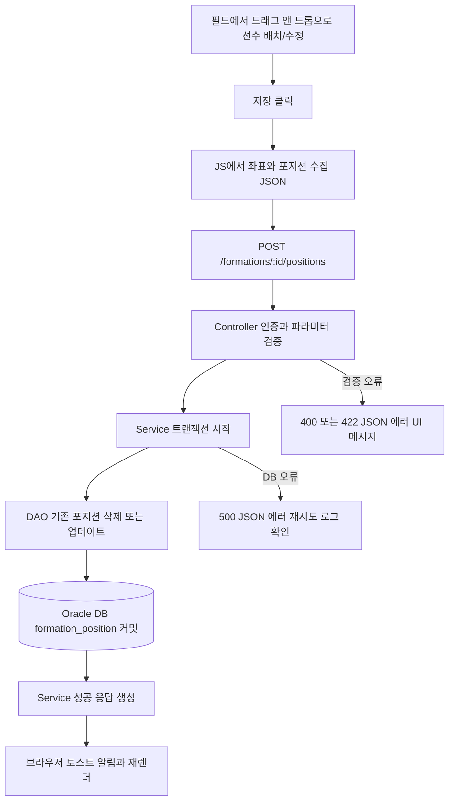
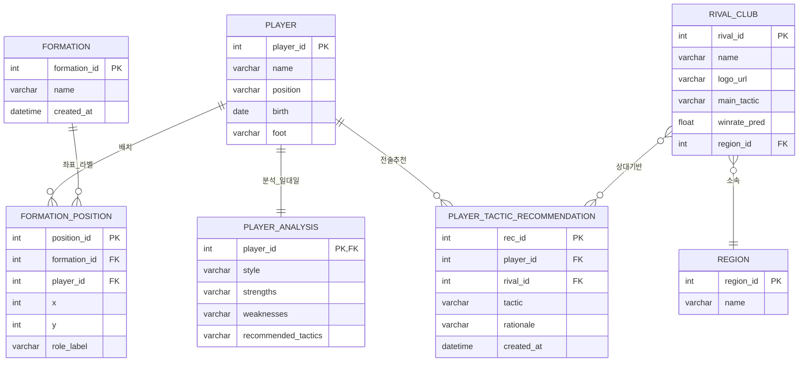

# HosungFC — 축구팀 관리자 시스템
JSP + Java(서블릿/DAO) + Oracle 기반의 **팀 운영/전술 추천 관리자 페이지**  
포메이션 드래그앤드롭, Kakao Map 라이벌 분석, Hugging Face + 규칙 엔진 전술 코멘트

---

## #0. 프로젝트 개요
**프로젝트 이름**: HosungFC (축구팀 관리 & 전술 추천 시스템)

**프로젝트 목적 및 개요**  
아마추어 감독/코치를 위해 **선수 · 포메이션 · 라이벌 분석 · 전술 추천**을 한 곳에서 제공하는 관리자 사이트를 구축.  
선수 데이터와 상대 전술 정보를 바탕으로 **규칙 엔진**에서 1차 추천안을 만들고, **Hugging Face Inference API**로 전술 설명을 **요약·보완**하여 의사결정을 돕는다.  
드래그앤드롭 포메이션 편집, Kakao Map 기반 라이벌 정보 시각화로 **운영 효율**과 **가독성**을 확보한다.

**프로젝트 기간**: 2025.05.30 ~ 2025.07.09

---

## 기술 스택

### 프론트엔드 (View / JSP 기반)
- JSP, HTML5, CSS3, JavaScript(ES6), jQuery  
- Bootstrap, Kakao Map JavaScript API


### 백엔드
- Java, Servlet/JSP(MVC2), Service/DAO 계층  
- MyBatis 또는 JDBC Template  
- Hugging Face Inference API (GPT-2 계열 요약/코멘트)  
- Ajax(JSON) 기반 API


### 데이터베이스
- **Oracle**  
- 주요 테이블: `player`, `formation`, `formation_position`, `rival_club`, `region`, `player_analysis`, `player_tactic_recommendation`


### 빌드 도구 / 개발 환경
- Eclipse 또는 VS Code, Maven, Apache Tomcat, Git/GitHub, WAR 패키징


---

## #1. 설명

### 시스템 아키텍처 (Mermaid)


### 시스템 흐름도 (AI 전술 추천)


### 포메이션 저장 흐름도 (Drag&Drop → 좌표 저장)


**AI 추천 흐름 요약**  
1) DB에서 선수 스타일/강점/약점과 상대 전술을 조회  
2) 규칙 엔진으로 1차 추천 생성  
3) HF Inference API로 코멘트/설명 생성  
4) 결과 병합 후 화면에 노출 (API 실패 시 규칙 결과만 노출)

---

## #2. 요구 사항 분석
- 로그인/권한(선택): 관리자만 접근 가능하도록 보호  
- 선수 관리: 등록/수정/삭제, 이름/포지션 검색, 페이징  
- 포메이션 관리: 드래그앤드롭 배치, 좌표/라벨 저장, 수정/삭제  
- 라이벌 분석: Kakao Map 마커, 지역 필터, 모달에 전적/전술/예상 승률 표시  
- AI 전술 추천: 규칙 엔진 결과를 기본으로, HF 요약/코멘트로 보완  
- 안정성: Ajax 표준 응답(JSON), 예외 메시지 규격화, 필드 검증

---
## 🎥 데모 영상 모음

### 🎥 포메이션 드래그앤드롭
[영상 보기](https://raw.githubusercontent.com/ghtjdgg-hh/hosungfc/main/hosungfc-formation.mp4)

### 🎥 라이벌 분석
[영상 보기](https://raw.githubusercontent.com/ghtjdgg-hh/hosungfc/main/hosungfc-rival-map.mp4)

### 🎥 AI 전술 추천
[영상 보기](https://raw.githubusercontent.com/ghtjdgg-hh/hosungfc/main/hosungfc-ai-reco.mp4)


## 🖼️ 시스템 이미지
[](https://raw.githubusercontent.com/ghtjdgg-hh/hosungfc/main/assets/architecture.png)
[](https://raw.githubusercontent.com/ghtjdgg-hh/hosungfc/main/assets/sequence.png)
[](https://raw.githubusercontent.com/ghtjdgg-hh/hosungfc/main/assets/erd.png)


> GIF 미리보기를 함께 두고 싶다면 아래처럼 사용하세요.  
> `assets/hosungfc-formation.gif` 파일을 추가하세요.  
> 

---

## 작성자용: 동영상 업로드/임베드 가이드
<details>
<summary>펼치기</summary>

### A) 저장소에 직접 넣기 (간단, 100MB 이하 권장)
1. 저장소 루트에 `assets/` 폴더 생성  
2. `hosungfc-formation.mp4` 등 영상을 업로드  
3. README에서 상대경로로 임베드:  
   ```html
   <video src="assets/hosungfc-formation.mp4" controls muted playsinline width="720"></video>
   ```
4. 재생이 안 되면 **raw 링크** 사용:  
   ```html
   <video src="https://raw.githubusercontent.com/ghtjdgg-hh/hosungfc/main/assets/hosungfc-formation.mp4" controls muted playsinline width="720"></video>
   ```

### B) GitHub Releases 에 올리기 (안정적 배포)
- Releases 탭 → New release → 영상 업로드(assets)  
- 업로드된 파일의 URL을 `<video src="...">` 에 사용

### C) Git LFS 사용 (100MB 초과 파일)
```bash
git lfs install
git lfs track "*.mp4"
git add .gitattributes
git add assets/hosungfc-*.mp4
git commit -m "Add videos with Git LFS"
git push origin main
```
> 팀 저장소 용량 정책을 확인하세요.

### D) 인코딩/압축 권장(ffmpeg 예시)
```bash
# 720p, H.264 + AAC, 크기 절감
ffmpeg -i input.mov -vf "scale=-2:720" -c:v libx264 -preset slow -crf 23 -c:a aac -b:a 128k hosungfc-formation.mp4

# 움직임 많은 화면은 CRF 24~28로 조절
ffmpeg -i input.mp4 -c:v libx264 -crf 26 -preset medium -c:a aac -b:a 128k output.mp4
```

### E) HTML5 `<video>` 옵션 팁
- `controls`: 플레이어 UI 표시  
- `muted`: 자동재생 정책에 유리  
- `playsinline`: iOS에서 전체화면 전환 방지  
- `poster="assets/thumb.png"`: 썸네일 지정

</details>

---

## 📄 데이터베이스 설계 (ERD · Mermaid)


---

## 🔌 환경 변수 / 설정
`.env` 또는 서버 환경변수로 관리

```bash
# Kakao Map
KAKAO_MAP_APPKEY=여기에_키

# Hugging Face Inference API
HF_API_URL=https://api-inference.huggingface.co/models/gpt2
HF_API_TOKEN=hf_xxxxxxxxxxxxxxxxxxxxx
```
